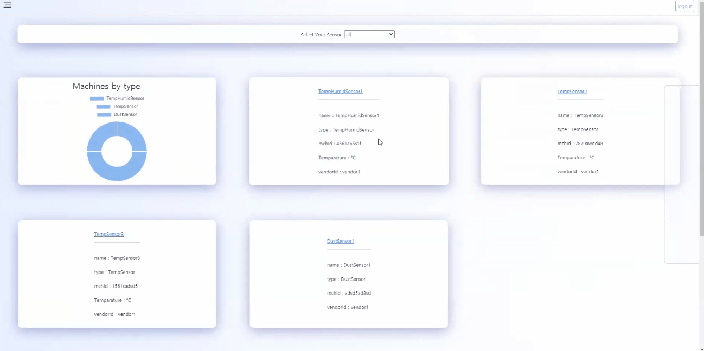
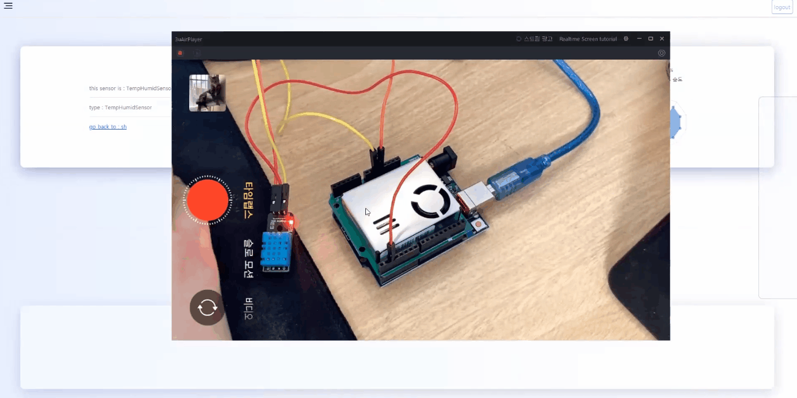
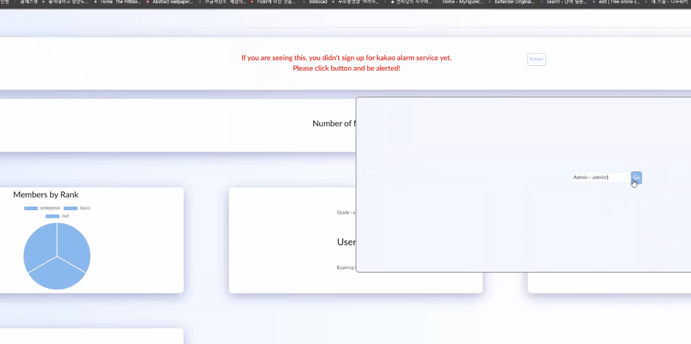

# Home Tech Friends

이 프로젝트에서는 마치 공장에서 안전을 위해 기계를 관리하는 것 처럼, 우리 집과 나의 안전을 중점으로 하는 컨셉을 가지고자 합니다.

[Frontend 부 저장소](https://github.com/0712023/htf-frontend)

# Introduction

IoT란 Internet of Things의 준말로 사물끼리 인터넷으로 연결돼 정보를 주고받는 사물인터넷을 의미합니다. 그리고 이 IoT는 현재 곳곳에서 우리들의 삶을 윤택하게 해 주고 있습니다. 특히 최근 주거와 IoT를 접목한 스마트 아파트들이 큰 관심을 받고 있는데 이러한 아파트들은 상당히 고가에 거래되고 있습니다.

따라서 노후 주택에도 언제든지 적용 가능한 IoT 시스템을 구축하는 것을 목표로 했습니다. 상대적으로 저렴한 비용의 센서들을 활용하여 IoT 환경의 대중화 및 범용성을 증대시키는 것을 목적으로 했습니다.

# Team

권오민

김민건

김성호

김재웅

김창훈

# Architecture


# Environment

## FRONT

- Vue.js
- Node.js

## BACK

- JSON Web Token
- Spring Boot

## DB

- ORACLE DB
- MySQL

## SERVER

- Tomcat
- Socket IO

## VCS

- Git Hub

## etc

- ESLint

# ORACLE DB ERD


# Directory

### Front-end

- Vue CLI server

    ```jsx
    ./
    ├── node_modules/                       # node모듈
    ├── public/                             # 정적 문서
    ├── src/                                # 소스 파일
        ├── asset/                          # 어셋 파일
        ├── components/                     # 컴포넌트
        ├── router/                         # 라우터
        ├── store/                          # 스토어
        └── views/                          # 페이지(뷰) 컴포넌트
            ├── Admin/                     
            ├── Dashbooard/
            ├── Kakao/
            ├── Login/
            ├── Member/
            ├── Modal/
            ├── Updates/
            └── Vendor/
    ```

### Back-end

- Rest Controller / Spring Boot / JPA / Oracle linked

    ```java
    ./
    ├── src/
    |       ├── htf.backend/                    
    |   |   ├── controller/                 # 컨트롤러
    |   |   ├── dao/                        # DAO
    |   |   ├── domain/                     # ENTITY
    |   |   ├── exception/                  # 예외처리
    |   |   ├── kakao/                      # KAKAO API
    |   |   ├── logger/                     # 로그
    |   |   ├── security/                   # JWT API
    |   |   ├── serviece/                   # 서비스 로직
    |       └── util/                       # CommandLineRunner
    ├── src/resources                       # Spring properties
    └── test/                               # 테스트 파일
    ```

### Sub Chat Server

- node.js server / socket.io / mysql linked

    ```java
    ./
    ├── node-modules/
    ├── db/                                  # mysql 연결
    ├── index.js                             # 서버 도입부
    └── sessionStore.js                      # 세션 관리
    ```

# Core Skills

- Json Web Token(JWT)를 활용한 server 접근 권한
- Three.js를 활용한 3D modelling
- Chart.js를 활용한 데이터 시각화
- 화재 상황 발생시 근방의 모든 서비스 유저에게 카카오톡 알림을 전송
- 카카오페이를 활용한 정기 구독 서비스
- 실제 Aduino센서를 활용한 데이터 측정 및 관리
- socket을 활용한 실시간 채팅 서비스

# Sequence Diagram


# Demonstration








# Getting started

Initialize DB Tables

```
Run as Spring Boot App

```

Run Front 🐳

```
npm install
npm run serve

```

Run Server🎄

```
cd server
npm install
npm start
```
